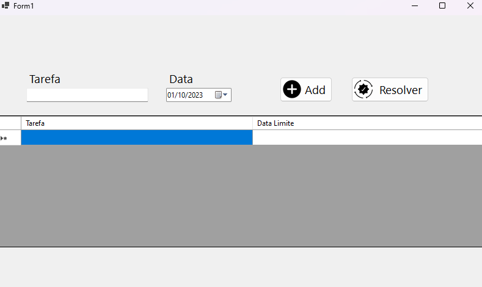
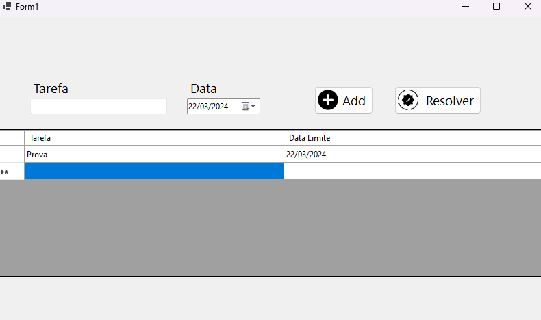

<h1 align="center">App Controle de Tarefas</h1>

### Tecnologias Utilizadas:
* C#
* Windows Forms

### Ferramentas Utilizadas:
* Microsoft Visual Studio

### Funções do Software:
* Sistema de controle de tarefas em C#, com o componente DataGridView.
* Funções para salvar e carregar os dados em anexo. 

  ### Telas do Forms:

<figure>
  
</figure>

<figure>
  
</figure>

